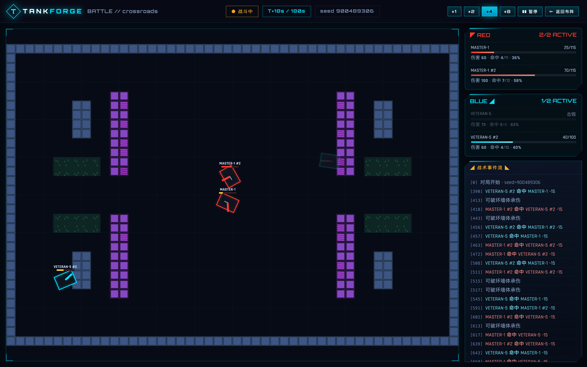
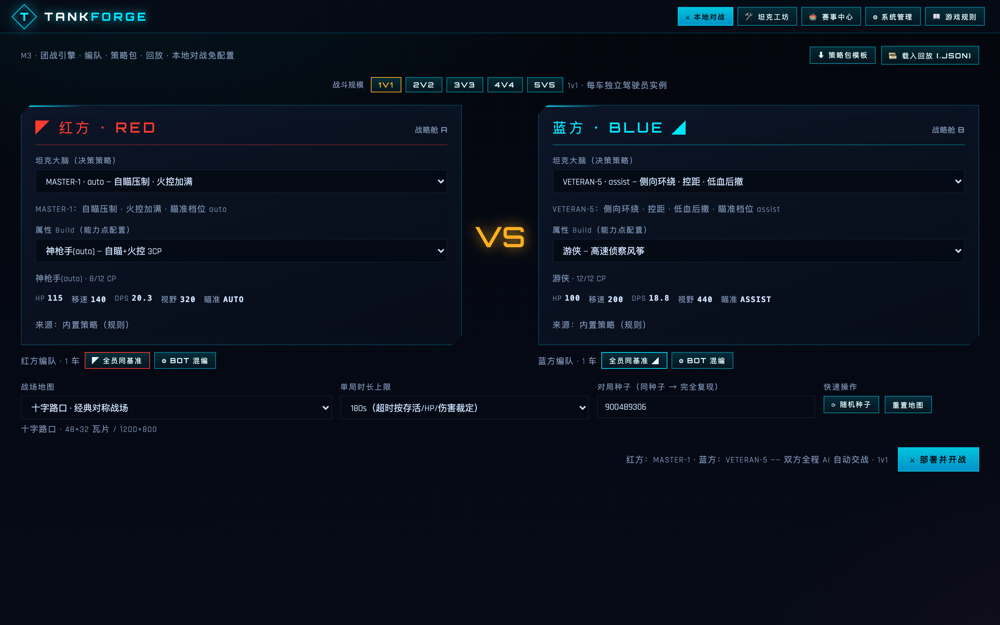
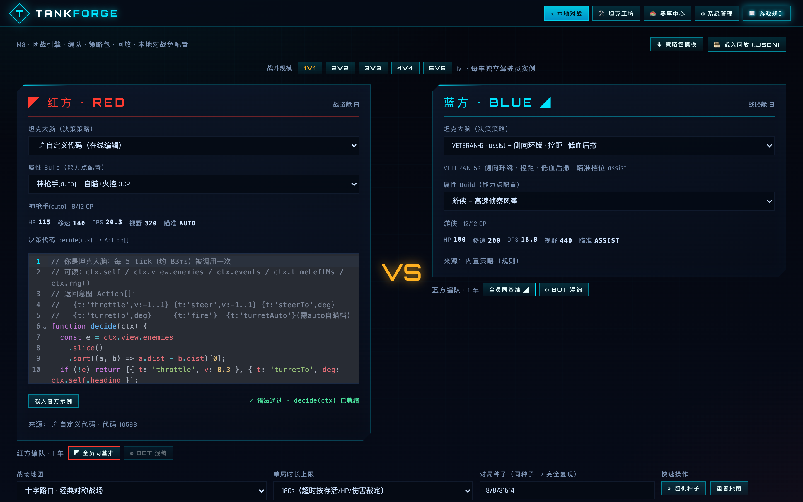
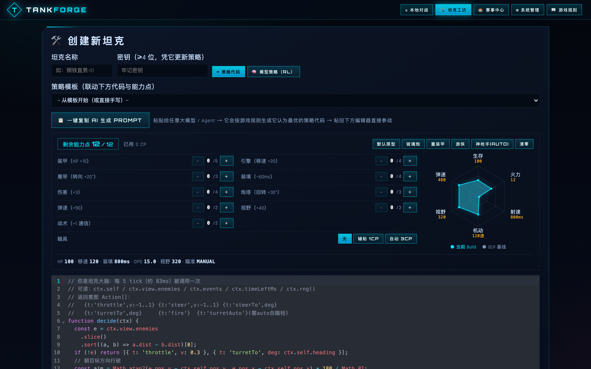

<div align="center">

# TANKFORGE · 坦克策略对战平台

**你写策略，坦克自己打** —— 浏览器里的 AI vs AI 坦克竞技场

把一段 JavaScript，或一个训练好的神经网络，装进坦克里，看它在战场上自己走位、索敌、开火、团战。

[](./LICENSE)


[核心特性](#-核心特性) · [快速开始](#-快速开始) · [玩法](#-玩法与界面) · [RL 训练](#-rl-训练三种方式练出一个会打仗的神经网络) · [项目结构](#-项目结构) · [文档](#-文档索引)



</div>

---

## 这是什么

TANKFORGE 是一个**可编程坦克对战平台**：

- 给坦克上传一段 JS 策略（`decide(ctx)`），或者训练一个神经网络（强化学习）当大脑；
- 在**完全确定性的战斗引擎**里，让坦克与其他坦克实时对战——单挑、组队团战、天梯赛、吃鸡赛；
- 引擎会裁决每一个动作（移动、炮塔、开火、通信），战绩、回放、排行榜一条龙。

一句话：**这是一个"从写第一行策略代码到跑 PPO 自我对弈"的梯度平台**，新手能玩，研究者也能玩。

## ✨ 核心特性

| | |
|---|---|
| 🎯 **确定性引擎** | 同一种子 + 同一份配置 = 逐 tick 完全复现。回放可校验指纹，服务端结算前端重演，帧级一致 |
| 🧩 **意图式规则** | 策略只能提交意图，引擎裁决一切。天然防作弊（改不了血量改不了弹道） |
| 🛡 **双端沙箱** | 前端 Web Worker / 服务端 Node vm，同一份代码双端语义严格一致（含带状态策略） |
| 🧠 **三种坦克大脑** | 手写 JS 策略 / 内置 AI（三档难度）/ 强化学习模型（MLP，24 维观测 → 18 动作） |
| ⚔ **团战与通信** | 每队 1~5 车：队友数据链共享视野 + 有限通信槽位，配合战术是胜负手 |
| 🏗 **能力点 Build** | 血/速/攻/伤/转向/视野/装甲/火控 8 项，12 点预算——没有最强出装，只有流派 |
| 🗺 **多地图** | 十字路口 / 遗迹竞技场 / 旷野，掩体、草丛、视野遮挡全部参与博弈 |
| 🏟 **赛事系统** | 天梯赛 / 吃鸡赛、报名、组队、免密钥挑战、赛事主页**实时排行榜** |
| 🎬 **回放系统** | 录制 / 载入 / 拖动进度 / 指纹防漂移，任何一场对局都可重演复盘 |
| 🤖 **RL 训练管线** | 进化训练（零 Python）/ PPO / 自我对弈联赛，环境直接桥接真实引擎——**训练即实战** |
| 🗄 **可选后端** | Express + MySQL：账号（密钥哈希）、赛事、队伍、战绩持久化 + 只读 SQL 控制台 |

## 🚀 快速开始

### 方式一：只玩单机对战（30 秒，零后端依赖）

```bash
git clone https://github.com/lizheSun/tankforge.git
cd tankforge
npm install
npm run dev          # → http://localhost:5173
```

打开页面即可：本地布阵对战、坦克工坊写策略、看回放——全程本地运行，不需要数据库。

### 方式二：完整体验（赛事 / 排行榜 / 持久化）

需要本机有 **MySQL 8**：

```bash
npm install
npm run server       # 终端 A：后端 → http://localhost:8787
npm run dev          # 终端 B：前端 → http://localhost:5173
```

打开「⚙ 系统管理」→ 填写 MySQL 连接 → 一键初始化数据表，赛事中心即刻可用。

### 生产构建

```bash
npm run build        # 类型检查 + 打包到 dist/
npm run preview      # 本地预览产物
```

## 🎮 玩法与界面

五个页面，一条从入门到进阶的路径：

| 页面 | 干什么 |
|---|---|
| ⚔ **本地对战** | 布阵开打：选地图、配 Build、双方挂策略（脚本 / 内置 AI / 模型），实时观战 + 战报 |
| 🛠 **坦克工坊** | 创建坦克：名称 + 密钥（防冒名）+ 大脑（JS 策略 / RL 模型上传），可导入导出策略包 |
| 🏟 **赛事中心** | 天梯赛 / 吃鸡赛：报名 → 组队 → 发起挑战 → 实时排行榜，一切对战入库可回放 |
| ⚙ **系统管理** | MySQL 数据源配置、数据浏览、只读 SQL 控制台 |
| 📖 **游戏规则** | 完整规则手册：引擎机制 + 赛事规则 + **RL 训练完全攻略** |



<sub>本地布阵：双方各挂策略（内置 AI / 自定义代码 / RL 模型），配好 Build 一键开战</sub>

### 坦克大脑长什么样

一段完整的策略就这么多——引擎每 5 个物理 tick（约 83ms）调用一次 `decide(ctx)`，你返回意图数组：

```js
function decide(ctx) {
  const self = ctx.self;
  // 1. 找最近的可见敌人（视野是扇形 + 障碍遮挡，看不到就是看不到）
  const e = ctx.view.enemies.slice().sort((a, b) => a.dist - b.dist)[0];

  if (!e) {
    // 2. 无目标：朝地图中心搜索前进
    const bearing = Math.atan2(ctx.map.h / 2 - self.pos.y, ctx.map.w / 2 - self.pos.x) * 180 / Math.PI;
    return [{ t: 'throttle', v: 1 }, { t: 'steer', v: 0.4 }, { t: 'turretTo', deg: bearing }];
  }

  // 3. 有目标：保持中距离、炮塔锁定、进入射程即开火
  const aim = Math.atan2(e.pos.y - self.pos.y, e.pos.x - self.pos.x) * 180 / Math.PI;
  const acts = [{ t: 'turretTo', deg: aim }, { t: 'throttle', v: e.dist > 420 ? 1 : -0.2 }];
  if (e.dist < 520) acts.push({ t: 'fire' });
  return acts;
}
```

可用动作：`throttle`（油门 ±1）、`steer`（转向 ±1）、`turretTo`（炮塔指向角度）、`fire`（开火，受冷却限制）……

> 观测里能看到：自身 HP/冷却/朝向、最近可见敌的位置/速度/HP/夹角、剩余时间、通信收件箱、地图信息等。
> 完整契约见 [`docs/BATTLE_SPEC.md`](docs/BATTLE_SPEC.md)。



<sub>在线编辑器：直接写 decide(ctx)，输入即诊断，存好就能参战</sub>

### 赛事系统怎么玩

1. **报名**：在赛事主页凭坦克密钥把坦克挂进赛事名单（防冒名）
2. **组队**（可选）：凭密钥创建 / 加入队伍，每队 1~5 车、一车只能属一队；不组队也能单挑
3. **发起挑战（免密钥）**：单挑直接选人；团战选两支队伍开打（1~5 v 1~5，引擎真实团战：数据链 + 通信生效）
4. **看排行榜（实时）**：每次打开赛事主页现算，排名规则清楚可查——

```
积分 = 胜场 × 3 + 平局 × 1 + 击杀 × 1 + 命中率 × 5
同分依次比较：胜场 → 击杀 → 命中率 → 场次少者优先 → 名字
队伍团战按队记胜负：胜方每辆车各 +1 胜
```

## 🤖 RL 训练：三种方式练出一个会打仗的神经网络

模型的接口是平台标准化的：**输入 24 维战场观测 → 输出 18 选 1 动作**（炮塔由平台辅助瞄准，模型专注走位与开火时机）。训练环境直接桥接**真实引擎**，不存在"训练场和实战不一致"。

| 路线 | 门槛 | 一句话 |
|---|---|---|
| ① 进化训练 | 零依赖（只要 Node） | 种群选优 + 变异迭代，几分钟出可用模型 |
| ② PPO 正式训练 | `pip install stable-baselines3 gymnasium numpy` | 强化学习正统路线，上限最高 |
| ③ 自我对弈联赛 | 同 ② | 先打赢 master，再逐轮打「上一轮的自己」，自动 10 轮 |

```bash
# ① 进化（零 Python 依赖，产物可直接上传）
npm run evolve 100 16

# ② PPO（桥接真实引擎，8 个并行环境）
python3 scripts/rl/train_ppo.py --steps 2000000 --envs 8 --opponent veteran

# ③ 自我对弈联赛（自动化课程：master → 自己 → 更快的自己 …）
python3 scripts/rl/selfplay.py --rounds 10

# 导出为可在工坊上传的模型文件
python3 scripts/rl/export_sb3.py tank-ppo.zip -o my-tank.json
```

训练完：**坦克工坊 → 🧠 模型策略（RL）→ 上传 `my-tank.json` → 创建坦克参战**。



<sub>坦克工坊：12 点能力 Build 预算 + 实时雷达图 + 大脑（JS / RL 模型）挂载</sub>

> 从奖励设计到自定义训练管道（改奖励塑形、换陪练池、调网络结构、甚至接入自己的算法），
> 详见游戏内「📖 游戏规则 → RL 模型训练完全攻略」，或直接看 [`scripts/rl/`](scripts/rl/)。

## 🔬 引擎亮点（给好奇的人）

<details>
<summary><b>为什么说「确定性」是这个项目的灵魂？</b>（点开）</summary>

- 引擎内部**禁止** `Date.now()` / `Math.random()`，一切随机来自种子化 RNG → 同一种子逐 tick 复现
- **服务端权威结算，前端重演**：服务端跑完一局把 seed + 双方策略存回，前端用同一套引擎重演出完整画面，帧级一致，无需传输每一帧
- **回放可以校验指纹**：录制时存指纹，重演时比对，漂移立刻可见（改了引擎没改版本会当场暴露）
- 因此：排行榜可信、回放可信、训练环境 = 实战环境（RL 训出来的模型所见即所得）

</details>

<details>
<summary><b>用户策略是怎么被安全执行的？</b>（点开）</summary>

- 前端：独立 **Web Worker** 沙箱执行，每局独立实例（记忆不跨局泄漏），主线程渲染不被阻塞
- 服务端：Node **vm** 沙箱，两段式加载（顶层只执行一次，每帧只调用 `decide`）
- 两端对"带状态的策略"语义严格一致（例如模型大脑的目击记忆在双端都能跨决策帧保持）
- 策略只能产出意图，引擎裁决一切；违规会被制裁，失联会被判负

</details>

<details>
<summary><b>团战为什么不一样？</b>（点开）</summary>

- 每队 1~5 车，**队友数据链**：全队共享敌方目击信息（位置会同步给队友）
- **通信槽位有限**：想要更复杂的信息传递？用站内通信（`sendTo` / `inbox`），但每帧槽位有限——这就是战术取舍
- 出生点按队伍阵型生成，地图掩体/草丛对双方公平

</details>

## 🗂 项目结构

```
tankforge/
├── src/
│   ├── game/              # 确定性战斗内核（引擎 / 地图 / 弹道 / Build / Bot / 模型大脑）
│   ├── sandbox/           # 用户策略沙箱（Web Worker）
│   ├── replay/            # 回放录制 / 重演 / 指纹校验
│   ├── render/            # Canvas 渲染
│   ├── pack/              # 策略包（.zip）导入导出
│   └── ui/                # React 界面
├── server/                # 可选后端：Express + MySQL（赛事 / 组队 / 权威结算 / SQL 控制台）
├── scripts/
│   ├── rl/                # RL 训练管线：bridge / PPO / 进化 / 自我对弈 / SB3 导出
│   ├── headless.ts        # 冒烟：内置 Bot 自动对局
│   ├── stress.ts          # 压力 / 平衡测试
│   └── replaycheck.ts     # 回放确定性校验
├── docs/
│   ├── BATTLE_SPEC.md     # 战斗系统技术规格（引擎契约）
│   └── screenshots/       # README 截图（npm run shots 重新生成）
├── REQUIREMENTS.md        # 产品需求文档
└── CONTRIBUTING.md        # 贡献指南
```

## 📜 常用命令

| 命令 | 作用 |
|---|---|
| `npm run dev` | 前端开发服务器（:5173） |
| `npm run build` | 类型检查 + 生产构建 |
| `npm run server` | 后端（:8787，watch 热重载） |
| `npm run smoke` | 冒烟测试：内置 Bot headless 自动对局 |
| `npm run m1` | 压力测试：批量对局统计与平衡数据 |
| `npm run m1:strict` | 严格模式压力测试（任何偏差即失败） |
| `npm run m3` | 团战场景测试 |
| `npm run replay:check` | 回放确定性校验 |
| `npm run evolve [代数] [种群] [输出]` | 进化训练（默认 30 代 × 12 只） |
| `npm run shots` | 重新生成 README 截图（需先启动 `npm run dev`） |

## 📚 文档索引

| 文档 | 内容 |
|---|---|
| [`docs/BATTLE_SPEC.md`](docs/BATTLE_SPEC.md) | 战斗系统技术规格：引擎契约、动作/观测协议、通信、判负规则（**最权威**） |
| [`REQUIREMENTS.md`](REQUIREMENTS.md) | 产品需求文档：完整功能清单与设计决策 |
| [游戏内「📖 游戏规则」](src/ui/Rules.tsx) | 面向玩家的规则手册（含 RL 训练完全攻略、赛事规则） |
| [`CONTRIBUTING.md`](CONTRIBUTING.md) | 贡献指南：环境、结构、测试要求、提交规范 |
| [`CHANGELOG.md`](CHANGELOG.md) | 版本更新日志 |

## 🗺 路线图

- [x] 确定性战斗内核 + 本地对战 + 回放
- [x] 坦克工坊（JS 策略 / 策略包导入导出）
- [x] RL 训练管线（进化 / PPO / 自我对弈 / 模型上传）
- [x] 赛事系统（天梯 / 吃鸡 / 组队团战 / 实时排行榜 / MySQL 持久化）
- [ ] WebSocket 实时多人观战
- [ ] 更多模式（占点 / 夺旗）与新地图
- [ ] 战报分享页与赛季制

欢迎在 Issue 里提出你的想法。

## 🤝 贡献

欢迎任何形式的贡献：修 Bug、改文档、加内置 AI、提平衡建议。动手前请先读 [`CONTRIBUTING.md`](CONTRIBUTING.md)（里面写了必须跑的检查命令和"确定性铁律"）。

## 📄 开源协议

本项目基于 [MIT License](LICENSE) 开源，可自由使用、修改、分发（保留版权声明即可）。

---

<div align="center">
<sub>如果这个项目对你有启发，欢迎点一个 ⭐ Star</sub>
</div>
